# Document Upload Processing - Application and Infrastructure Architecture

**Document purpose:** authoritative technical architecture for the current Document Upload solution.  
**Scope:** application architecture, runtime behavior, data model, Azure infrastructure, deployment topology, sequence diagrams, reliability, scaling, security posture and production evolution.  
**Current validated workload:** 150 documents x 153 data rows/document = 22,950 cases.  
**Current validated performance:** 42.96 seconds end-to-end, 0 failed documents, 0 dead-lettered documents.  

> **Terminology:** a document is an uploaded Excel file. A case is one processed non-empty data row from that file. The benchmark uses 153 data rows per synthetic document, so `150 x 153 = 22,950` cases. The 10 columns are attributes of each case; they do not multiply the case count.

---

## 1. Architecture objectives

The solution is designed to process document bursts safely without allowing upload concurrency to become uncontrolled SQL or validation concurrency.

The main architecture objectives are:

- direct file upload without proxying file bytes through the API;
- durable asynchronous processing;
- one queue message per document, not per row;
- explicit backpressure through Azure Service Bus;
- bounded document processing concurrency;
- short SQL transactions;
- no SQL connection or transaction held across Blob download, Excel parsing or validation;
- deterministic and idempotent processing;
- exact Blob version processing plus SHA-256 integrity verification;
- retry and DLQ behavior for technical failures;
- atomic case persistence and document finalization;
- recovery of genuinely orphaned `PROCESSING` documents;
- observable batch, document and case state;
- infrastructure-as-code and automated deployment;
- a clear path from the current cost-sensitive environment to a production-hardened deployment.

---

## 2. System context

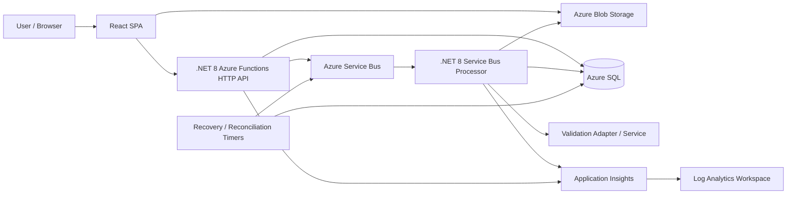

The browser and backend have deliberately different responsibilities:

- the browser transfers file bytes directly to Blob Storage;
- the API owns upload metadata, upload completion and queue publication;
- Service Bus owns durable processing backlog and retry delivery;
- the processor owns document verification, parsing, comparison, validation and persistence;
- Azure SQL owns durable business/process state;
- timers provide reconciliation and orphan recovery rather than normal orchestration.

---

## 3. Logical application architecture

```mermaid
flowchart TB
    subgraph Client[Client tier]
        REACT[React + Vite SPA]
        LOAD[Python 3.12 load/integration client]
    end

    subgraph ApiTier[HTTP/API tier - .NET 8 isolated Functions]
        PREP[POST /api/uploads/prepare]
        COMPLETE[POST /api/uploads/complete]
        STATUS[GET /api/batches/{batchId}]
        MOCK1[POST /api/mock/validate]
        MOCKB[POST /api/mock/validate-batch]
    end

    subgraph StorageTier[Storage and messaging]
        BLOB[(Blob container: incoming)]
        QUEUE[(Service Bus queue: document-processing)]
    end

    subgraph ProcessingTier[Processing tier - .NET 8 isolated Functions]
        WORKER[ProcessDocument Service Bus trigger]
        RECON[Reconcile timer]
        WATCH[RequeueStuckDocuments timer]
    end

    subgraph DataTier[Azure SQL]
        UB[UploadBatch]
        DU[DocumentUpload]
        CASE[Case]
        LINK[DocumentCaseLink]
        AUDIT[AuditEvent]
        REF[ReferenceData]
    end

    REACT --> PREP
    LOAD --> PREP
    PREP --> UB
    PREP --> DU
    PREP --> REACT
    REACT --> BLOB
    LOAD --> BLOB
    REACT --> COMPLETE
    LOAD --> COMPLETE
    COMPLETE --> DU
    COMPLETE --> QUEUE
    STATUS --> UB
    STATUS --> DU
    STATUS --> CASE
    QUEUE --> WORKER
    WORKER --> BLOB
    WORKER --> REF
    WORKER --> CASE
    WORKER --> LINK
    WORKER --> DU
    WORKER --> AUDIT
    WORKER -. external adapter when configured .-> MOCKB
    RECON --> DU
    RECON --> UB
    WATCH --> DU
    WATCH --> QUEUE
```

---

## 4. Application component responsibilities

| Component | Responsibility | Current implementation |
|---|---|---|
| React SPA | File selection, upload preparation, direct Blob upload, completion calls and status display | React + Vite |
| PrepareUpload | Validate file list and file size, create batch/document metadata, issue SAS URLs | HTTP-triggered .NET 8 Function |
| CompleteUpload | Resolve uploaded Blob/version, persist checksum/version metadata, publish deterministic queue message | HTTP-triggered .NET 8 Function |
| BatchStatus | Derive live batch status from document/case state | HTTP-triggered .NET 8 Function |
| ProcessDocument | Claim, download, verify, parse, compare, validate, persist and finalize a document | Service Bus-triggered .NET 8 Function |
| MockValidation | Single-case development validator | HTTP-triggered Function |
| MockValidationBatch | Batch development validator | HTTP-triggered Function |
| Reconcile | Repair stale processing state and refresh stored aggregate batch status | 5-minute timer |
| RequeueStuckDocuments | Recover genuinely orphaned `PROCESSING` documents after normal lock-renewal window | 1-minute timer |
| AzureClients | Reuse Blob and Service Bus SDK clients over Function-host lifetime | Static lazy clients |
| Db.Tx | Short explicit SQL transaction boundary | `Microsoft.Data.SqlClient` |
| Python load test | Generate synthetic XLSX files and drive the real Azure path | Python 3.12 + httpx + openpyxl |

---

## 5. Upload sequence

The upload path keeps file bytes away from the Function API and sends them directly to Blob Storage.

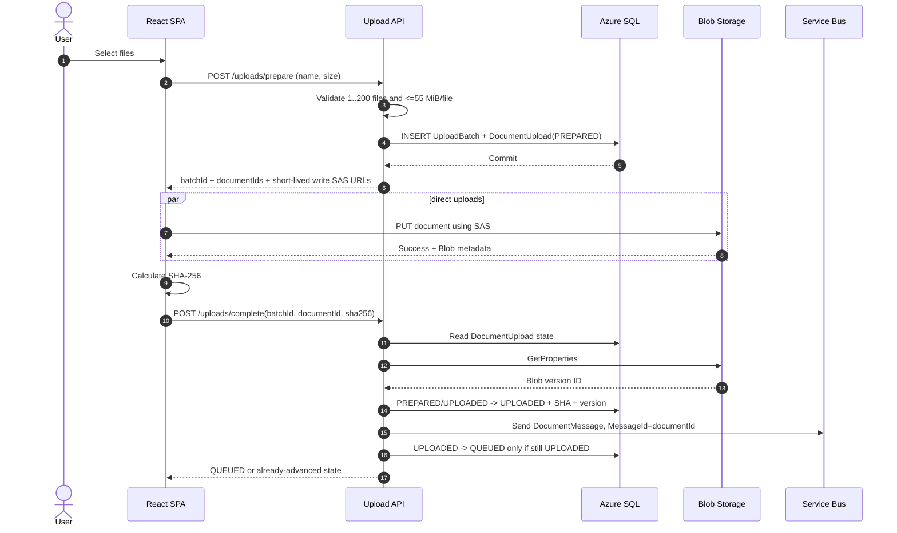

### Upload race protection

A Service Bus consumer can be faster than the HTTP completion path. Therefore:

1. the processor is allowed to claim documents in `UPLOADED`, `QUEUED`, `FAILED` or `PROCESSING` state;
2. the HTTP completion path changes `UPLOADED -> QUEUED` only when the row is still `UPLOADED`;
3. a worker that already advanced the row to `PROCESSING` cannot be moved backward to `QUEUED` by the HTTP request.

This closes the previously observed upload-publication race window.

---

## 6. Document processing sequence

```mermaid
sequenceDiagram
    autonumber
    participant SB as Service Bus
    participant Worker as ProcessDocument
    participant SQL as Azure SQL
    participant Blob as Blob Storage
    participant Parser as Excel Parser
    participant Val as Validation Adapter

    SB->>Worker: Deliver DocumentMessage (PeekLock)
    Worker->>SQL: Short TX: claim document, increment AttemptCount, audit PROCESSING_STARTED
    SQL-->>Worker: Commit + attempt count

    alt document already terminal / not claimable
        Worker->>SB: Complete duplicate/stale message
    else claimed
        Worker->>Blob: Download exact Blob version
        Blob-->>Worker: Document bytes
        Worker->>Worker: SHA-256 verification
        Worker->>Parser: Parse worksheet 1, rows 2..last, first 10 columns
        Parser-->>Worker: Parsed rows + deterministic CaseIds

        alt first attempt
            Worker->>Worker: Fast path; no finished-case lookup
        else retry/recovery attempt
            Worker->>SQL: Load already finished CaseIds
            SQL-->>Worker: Finished cases
        end

        Worker->>SQL: Load required ReferenceData keys
        SQL-->>Worker: Expected values
        Worker->>Worker: Calculate comparison results

        alt local development mock
            Worker->>Worker: Validate batches in-process
        else external validation configured
            Worker->>Val: Batched HTTP validation
            Val-->>Worker: Per-case validation results
        end

        Worker->>SQL: Final TX: SqlBulkCopy staging + set-based merge + links + document status + audit
        SQL-->>Worker: Commit atomically
        Worker->>SB: Complete message
    end
```

### Transaction boundary

The key durability boundary is intentionally narrow:

```text
slow/non-transactional work
    Blob download
    checksum
    Excel parse
    reference read
    validation

then

short final SQL transaction
    stage processed rows
    merge Case
    insert DocumentCaseLink
    set DocumentUpload final state
    write final AuditEvent

commit

then

complete Service Bus message
```

No SQL transaction is held while performing slow Blob, parsing or validation work.

---

## 7. Retry and DLQ sequence

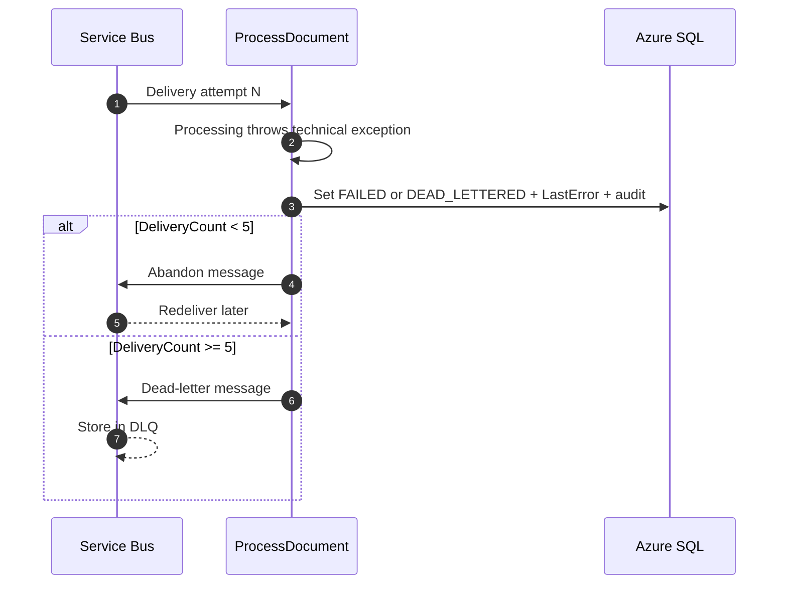

At-least-once delivery is expected. Correctness depends on deterministic identity and idempotent persistence rather than assuming exactly-once messaging.

---

## 8. Recovery watchdog sequence

Normal delivery and redelivery belong to Service Bus. The recovery watchdog is only for orphaned `PROCESSING` state after the normal 10-minute auto-lock-renewal window.

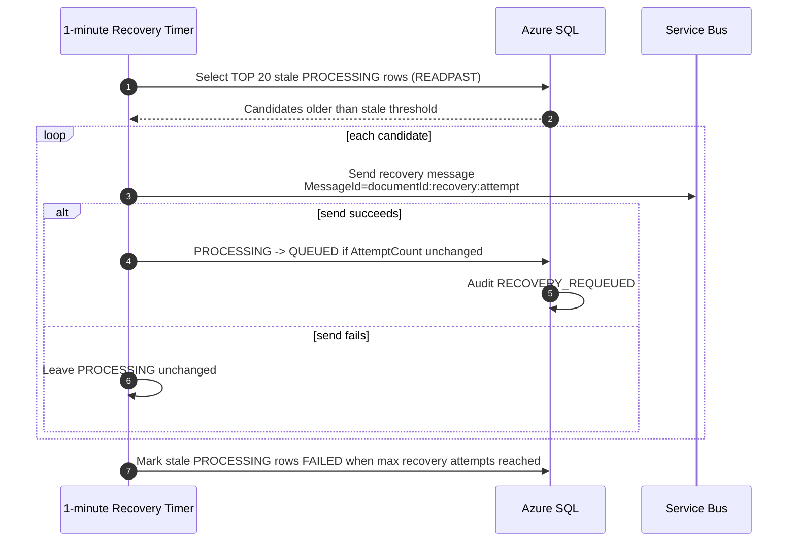

Current recovery defaults:

- timer frequency: every 1 minute;
- stale threshold: 720 seconds (12 minutes);
- minimum allowed stale threshold: 660 seconds (11 minutes);
- maximum attempts default: 5;
- candidate batch: TOP 20;
- deterministic recovery MessageId prevents duplicate recovery publication for the same attempt.

---

## 9. Batch-status sequence

The processing critical path no longer writes the shared `UploadBatch` row every time one document finishes. Live status is derived from document state, removing a hot-row write from concurrent processors.

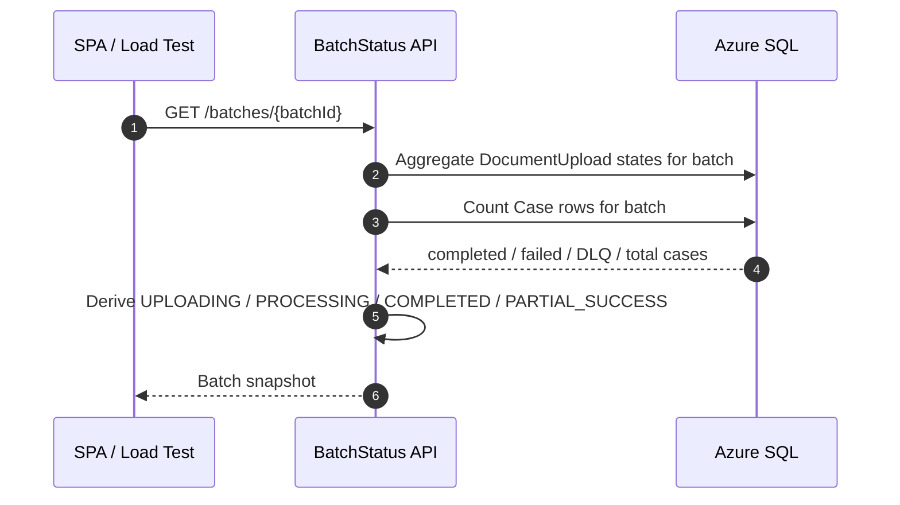

The separate reconciliation timer refreshes the stored `UploadBatch.Status` outside the normal per-document finalization path.

---

## 10. Application state model

### Document lifecycle

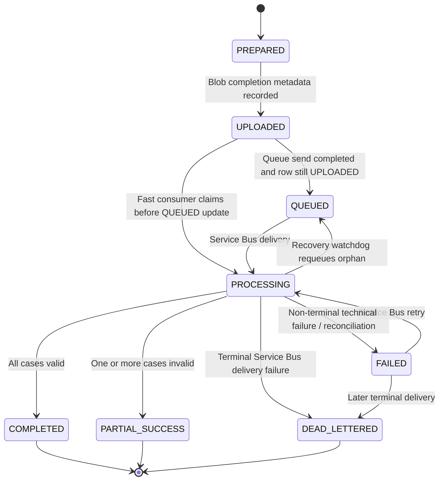

### Batch derived state

- `UPLOADING`: no document has meaningfully started processing yet;
- `PROCESSING`: at least one document has started and not all documents are terminal;
- `COMPLETED`: all documents are successful terminal states and no document is partial/failed/DLQ;
- `PARTIAL_SUCCESS`: all documents are terminal and at least one document is partial/failed/DLQ.

---

## 11. Data architecture

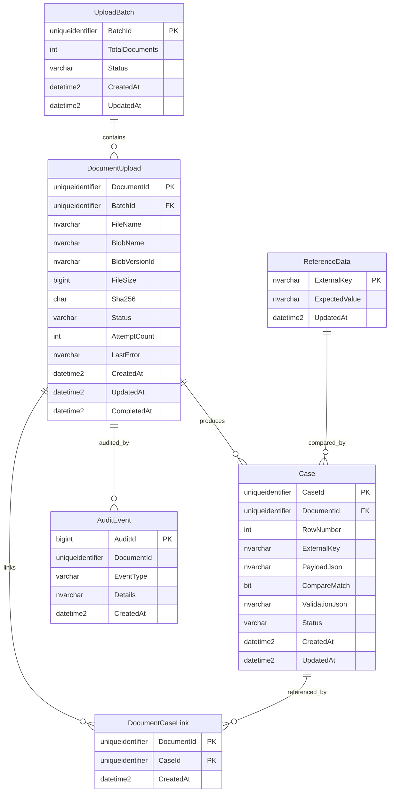

### Important constraints

- `DocumentUpload.BatchId` references `UploadBatch.BatchId`;
- `Case.DocumentId` references `DocumentUpload.DocumentId`;
- unique `(DocumentId, RowNumber)` protects row-level idempotency;
- `DocumentCaseLink` has composite primary key `(DocumentId, CaseId)`;
- index `IX_DocumentUpload_Batch_Status(BatchId, Status)` supports batch status/reconciliation queries;
- deterministic Case IDs are derived from `(documentId, rowNumber)`.

---

## 12. Benchmark workload model

The synthetic load test intentionally separates file-level and row-level workload.

```text
1 document
  -> 153 non-header data rows
  -> 10 columns per row
  -> 153 cases

150 documents
  -> 150 x 153
  -> 22,950 cases
```

The 10 columns are fields inside a case and do not create 10 cases.

The relationship is therefore:

| Documents | Rows/document | Total cases |
|---:|---:|---:|
| 1 | 153 | 153 |
| 50 | 153 | 7,650 |
| 150 | 153 | 22,950 |
| 153 | 153 | 23,409 |
| 500 | 153 | 76,500 |

This is a test shape only. Real production documents may have different row counts.

---

## 13. Azure infrastructure architecture

### Current development/test topology

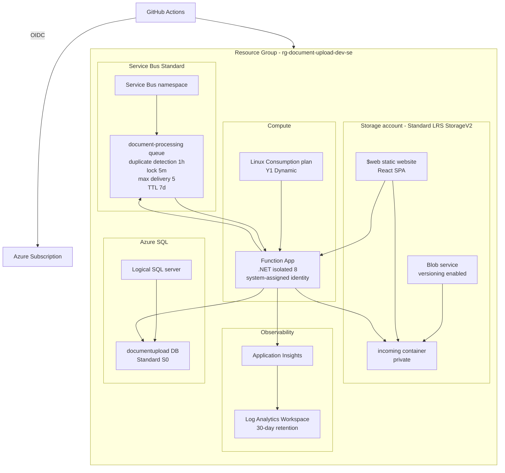

### Bicep resource profile

| Resource | Current configuration |
|---|---|
| Resource group | Deployment input; workflow default `rg-document-upload-dev-se` |
| Region | Deployment input; workflow default `swedencentral` |
| Log Analytics | 30-day retention |
| Application Insights | Workspace-based |
| Storage account | StorageV2, Standard_LRS, Hot, TLS 1.2, HTTPS only |
| Blob service | Versioning enabled, static website enabled |
| Upload container | `incoming`, no public Blob access |
| Service Bus namespace | Standard, TLS 1.2 |
| Queue | `document-processing` |
| Duplicate detection | 1 hour |
| Queue lock | 5 minutes |
| Max delivery count | 5 |
| Message TTL | 7 days |
| SQL | Azure SQL Standard S0 |
| SQL network | Public network enabled in current dev/test profile; Azure-services firewall rule enabled |
| Function plan | Linux Consumption Y1 |
| Function runtime | .NET isolated 8.0 |
| Function identity | System-assigned managed identity created |
| Function HTTPS | Required |
| FTPS | Disabled |
| CORS | Static-site origin plus configured development origins |
| SQL pool | Connection string has `Max Pool Size=15` |
| Max file bytes | 57,671,680 bytes (55 MiB) |

### Resource naming pattern

The Bicep template derives a deterministic suffix from subscription/resource-group/environment identity.

```text
Storage:      du<generated-suffix>
Function App: document-upload-<env>-<suffix>
Service Bus:  document-upload-<env>-<suffix>
SQL Server:   document-upload-<env>-<suffix>
Database:     documentupload
Queue:        document-processing
```

---

## 14. Network and security topology - current state

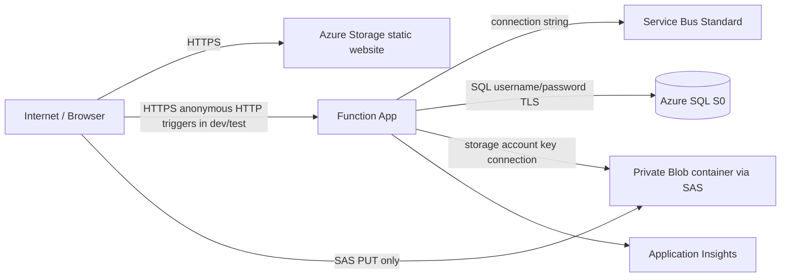

The current deployment is an architecture-validation/dev-test profile, not a final internet-facing enterprise security configuration.

### Current controls

- HTTPS-only Function App;
- minimum TLS 1.2;
- Storage public Blob access disabled;
- short-lived write SAS URLs;
- Blob versioning;
- SHA-256 verification;
- system-assigned Function identity exists;
- GitHub-to-Azure deployment uses OIDC rather than a long-lived Azure client secret;
- SQL connection encryption enabled;
- FTPS disabled.

### Production hardening required

A production target should add or complete:

- Microsoft Entra ID/App Service Authentication or an API gateway for HTTP endpoints;
- managed identity / Entra authentication for Azure SQL;
- managed identity + least-privilege RBAC for Service Bus and Storage instead of account/root-management connection strings;
- Key Vault references where secrets remain necessary;
- private endpoints/private networking where organizational policy requires them;
- network egress/ingress restrictions;
- transactional outbox for the strongest SQL-to-Service-Bus publication guarantee;
- Web Application Firewall/API Management where the external API risk profile requires it;
- production alerts and dashboards;
- formal data-retention and audit policies.

---

## 15. Service Bus concurrency architecture

Current `host.json`:

```json
{
  "version": "2.0",
  "extensions": {
    "serviceBus": {
      "prefetchCount": 0,
      "autoCompleteMessages": false,
      "maxConcurrentCalls": 8,
      "maxAutoLockRenewalDuration": "00:10:00"
    }
  }
}
```

Important: `maxConcurrentCalls=8` is **per Function host instance**, not a global system-wide limit.

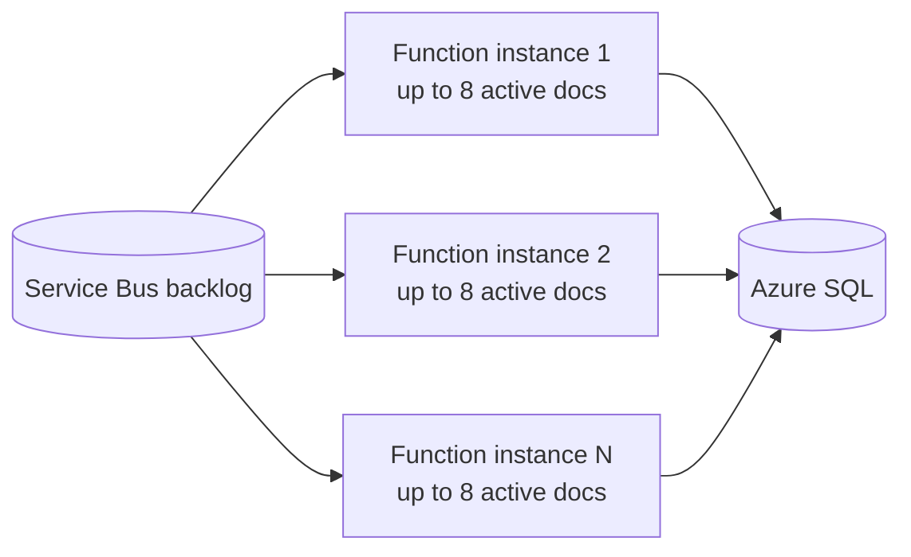

Approximate aggregate concurrency is:

```text
active Function instances x maxConcurrentCalls per instance
```

For production scale-out, downstream SQL and validation capacity must define the allowed aggregate concurrency. A larger queue backlog is not itself a reason to increase worker concurrency without measurement.

---

## 16. Validation architecture

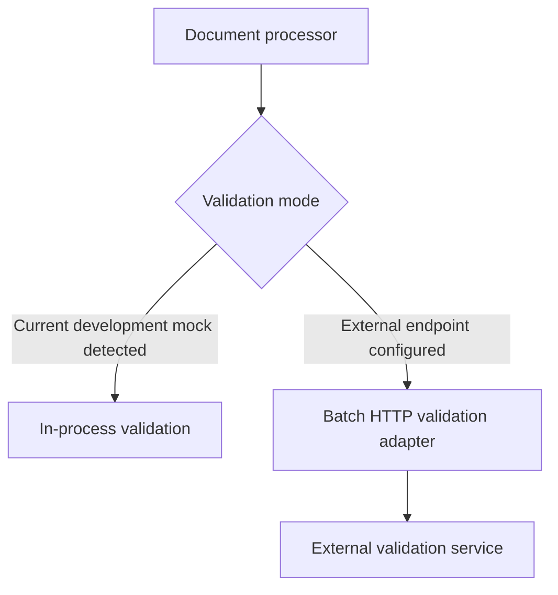

Current development behavior avoids the unnecessary pattern:

```text
processor -> HTTPS -> same Function App -> mock validator
```

while preserving the batch HTTP adapter for a future external service.

The current mock does not yet provide configurable latency, 429, transient 5xx or permanent fault injection. Those are recommended for enterprise resilience testing.

---

## 17. CI/CD and deployment architecture

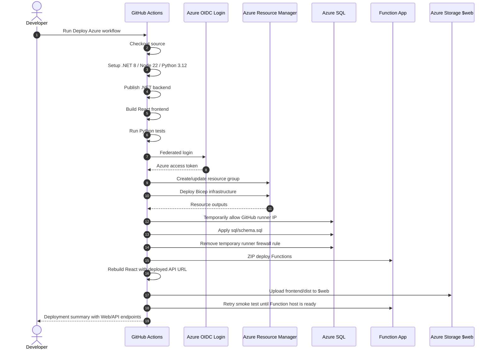

### Deployment pipeline technologies

- GitHub Actions;
- OIDC Azure login;
- .NET SDK 8;
- Node 22 for React build;
- Python 3.12 for tests;
- Bicep deployment;
- Microsoft SQL command-line tools container for schema application;
- ZIP deployment for the Function App;
- static-site upload to Azure Storage;
- post-deployment smoke test with warm-up retry.

---

## 18. Observability architecture

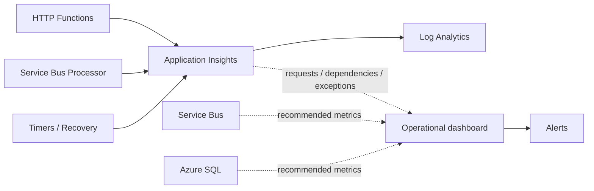

### Production metrics to monitor

Application:

- upload prepare latency/error rate;
- upload completion latency/error rate;
- document processing duration;
- document retry count;
- checksum failures;
- validation latency/error rate;
- cases processed/sec;
- documents processed/sec;
- batch completion duration.

Service Bus:

- active message count;
- oldest-message age / queue latency;
- incoming/outgoing messages;
- delivery count distribution;
- DLQ count, with alert threshold > 0.

SQL:

- DTU/CPU saturation;
- data/log IO;
- connection count;
- blocked sessions and lock waits;
- query duration;
- transaction-log pressure;
- deadlocks/timeouts.

Functions:

- active instance count;
- invocation count;
- failures;
- cold starts;
- execution duration;
- memory/CPU where available.

---

## 19. Current measured benchmark and architectural meaning

The current best validated run is:

```text
150 documents
153 data rows/document
10 columns/row
22,950 cases
15.31 seconds upload + completion + queue publication
42.96 seconds end-to-end
0 failed documents
0 dead-lettered documents
```

Compared with the original full baseline:

| Metric | Original baseline | Current optimized |
|---|---:|---:|
| Documents | 153 | 150 |
| Cases | 23,409 | 22,950 |
| End-to-end time | 168.53 s | 42.96 s |
| Documents/sec | ~0.91 | ~3.49 |
| Cases/sec | ~138.9 | ~534.2 |
| Normalized throughput | 1.0x | ~3.85x |

The benchmark demonstrates that the architecture solved the original uncontrolled-concurrency problem for the validated development/test workload. It is an architecture/load validation, not yet a complete production performance certification.

---

## 20. Scaling to multiple simultaneous batches

A validated concurrency test used three independent batches of 50 documents at the same time:

```text
Batch 1: 50 docs / 7,650 cases / 49.10s
Batch 2: 50 docs / 7,650 cases / 49.14s
Batch 3: 50 docs / 7,650 cases / 50.20s

Combined:
150 docs
22,950 cases
3/3 batches successful
0 failed
0 DLQ
~50.20s wall clock
```

This demonstrates that independent batches can safely share the same Service Bus queue, Function processors and database at this workload.

---

## 21. Future logical-batch architecture for 500+ documents

The current prepare API intentionally allows at most 200 files in one request. A direct 500-file prepare request is therefore not the desired production pattern.

Recommended evolution:

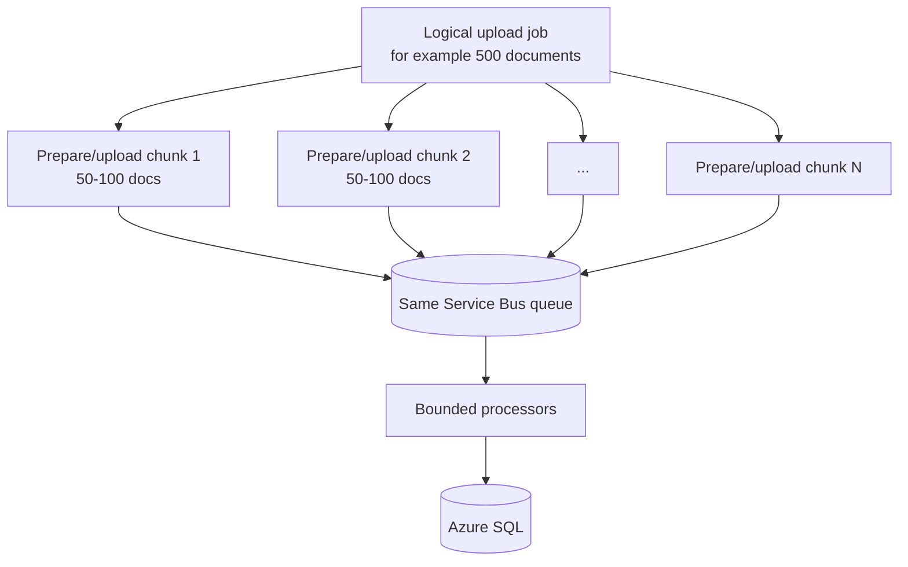

The UI should still show one logical user-visible job while the backend uses smaller upload-preparation chunks. This reduces large-request pressure without creating separate business jobs or row-level queue fan-out.

For the current synthetic workload:

```text
500 documents x 153 rows/document = 76,500 cases
```

---

## 22. Transactional outbox - recommended production evolution

The current upload race is mitigated by safe state transitions and deterministic Service Bus IDs. For the strongest enterprise guarantee across SQL metadata and queue publication, use a transactional outbox.

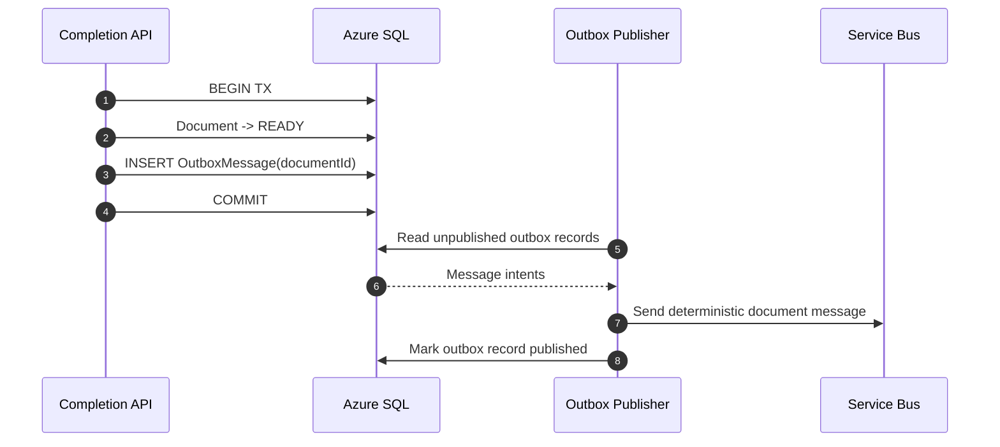

This removes the remaining cross-system crash window between SQL state change and Service Bus publication.

---

## 23. Architecture decisions and rationale

| Decision | Rationale |
|---|---|
| Service Bus as processing boundary | Durable backlog, backpressure, retries and DLQ |
| One message/document | Prevents 153-row fan-out per document |
| Direct browser-to-Blob | Avoids transferring large file bytes through API compute |
| Blob version ID + SHA-256 | Exact source/version and integrity verification |
| Bounded Function concurrency | Protect SQL/validation from burst concurrency |
| Manual message settlement | Complete only after durable processing succeeds |
| Deterministic CaseId | Makes redelivery/retry safe |
| Short SQL transactions | Prevents scarce DB connections/locks being held during slow work |
| SqlBulkCopy + set-based merge | Reduces row-oriented SQL overhead |
| Derived batch status | Removes shared batch-row write contention |
| Recovery watchdog | Safety net for true orphaned processing state |
| No Durable Functions/Logic Apps/Event Grid fan-out | No observed requirement justifies additional orchestration components |
| Current S0/Y1 environment | Cost-sensitive architecture-validation subscription |

---

## 24. Current architecture limitations

The following are known constraints rather than hidden assumptions:

- the prepare endpoint accepts at most 200 files per request;
- `maxConcurrentCalls=8` is per Function instance, not a global cap;
- current Azure SQL is Standard S0;
- current Function plan is Consumption Y1;
- HTTP Function endpoints are anonymous in the current dev/test deployment;
- SQL currently uses username/password authentication;
- Storage and Service Bus Function connections currently use connection strings/keys;
- public network access is enabled for current dev/test SQL, Service Bus and Function access paths;
- current mock validation does not inject latency/429/5xx/permanent failures;
- production transactional outbox is not yet implemented;
- full production dashboards/alerts/private networking are not yet represented in IaC;
- performance results are from architecture-validation runs, not formal enterprise production certification.

---

## 25. Production target architecture

The core application architecture should be retained. Production evolution should harden and scale it rather than replace it.

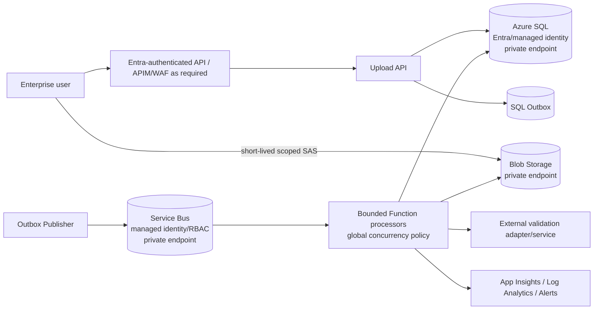

Potential production hosting/capacity changes should be benchmark-driven:

- Flex Consumption or Premium/warm compute if cold-start/predictability requires it;
- Azure SQL General Purpose/vCore only when capacity requirements justify cost;
- Service Bus Premium only when Standard metrics demonstrate a bottleneck;
- separate validation compute if the real validator becomes expensive or competes with document processing;
- explicit global concurrency control when multiple Function instances are allowed to scale out.

---

## 26. Architecture validation conclusion

The current design has validated the core architectural objective: transform an uncontrolled upload burst into a durable, bounded and retry-safe document-processing pipeline.

The proven current path is:

```text
React / Python client
    -> Upload preparation API
    -> direct Blob upload
    -> completion API
    -> Service Bus
    -> bounded .NET 8 processor
    -> reference comparison
    -> validation
    -> bulk/set-based SQL persistence
    -> atomic document finalization
    -> queue completion
```

The architecture is **enterprise-aligned**, while the current deployment remains a **cost-sensitive development/test profile**. Production work should focus on security hardening, stronger SQL-to-queue publication guarantees, global scale-out concurrency control, production observability and testing at the actual required production volume rather than introducing a different core orchestration architecture.

---

## 27. Related repository documentation

- [`architecture.md`](architecture.md) - concise runtime and reliability architecture.
- [`benchmark-workload-model.md`](benchmark-workload-model.md) - authoritative document/row/case terminology and calculations.
- [`enterprise-architecture-and-benchmarking.md`](enterprise-architecture-and-benchmarking.md) - enterprise benchmark maturity and production-performance assessment.
- [`project-conclusion.md`](project-conclusion.md) - project history, measured facts, configuration scenarios and conclusion.
- [`../infra/main.bicep`](../infra/main.bicep) - current Azure infrastructure definition.
- [`../sql/schema.sql`](../sql/schema.sql) - current durable SQL model.
- [`../backend/DocumentUpload.Functions/host.json`](../backend/DocumentUpload.Functions/host.json) - Service Bus concurrency/lock configuration.
- [`../.github/workflows/deploy.yml`](../.github/workflows/deploy.yml) - deployment pipeline.
